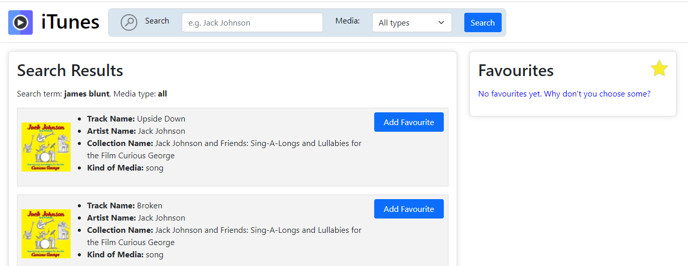
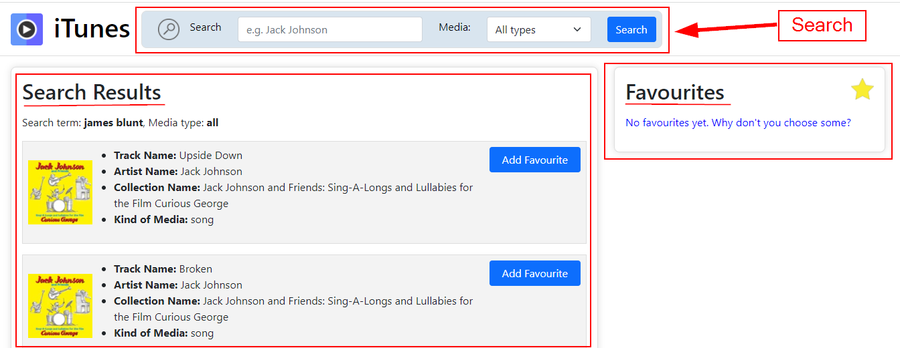
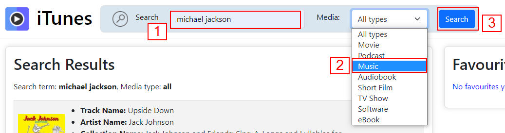
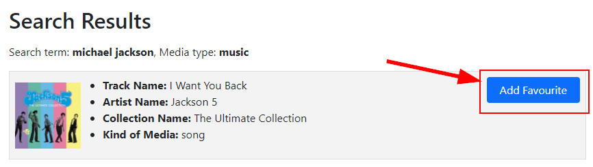
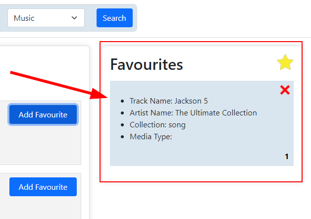
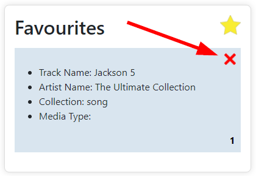
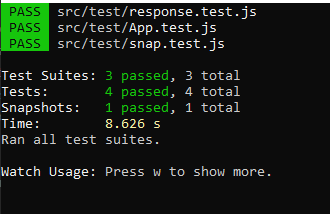
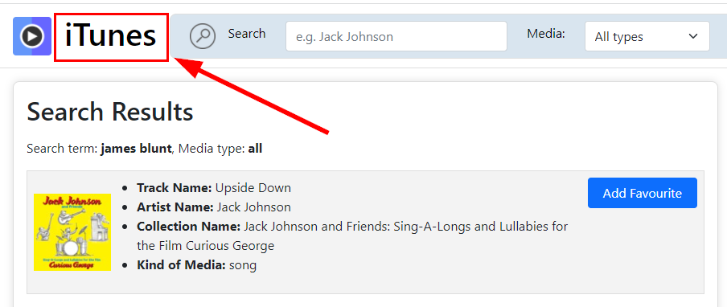
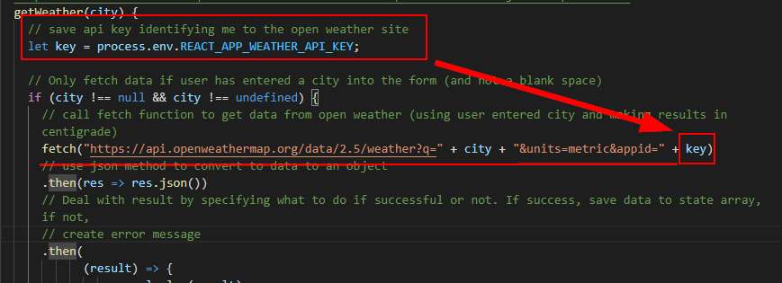

# HyperionDev Full Stack Web Development Bootcamp - Level 2 - Task 21 - Capstone project - iTunes app

## Description

This task is the Capstone project for level 2 and is an "iTunes app". It fetches a list of media (songs, movies, podcasts etc) using the [iTunes store API](https://affiliate.itunes.apple.com/resources/documentation/itunes-store-web-service-search-api/). The results are displayed on screen. The user can search for their own tracks or media and can specify which media type they want to search for. The user can also create a list of their favourites.

The app has been deployed with Heroku and can be viewed by opening the following URL in your browser: [https://ancient-scrubland-76228.herokuapp.com/](https://ancient-scrubland-76228.herokuapp.com/).

## Table of Contents

- [Instructions](#instructions)
- [Technologies](#technologies)
- [Installation](#installation)
- [Usage](#usage)
- [Tests](#tests)
- [Security](#security)
- [Credits](#credits)

## Instructions

These were the instructions I was given to guide me in this task:

**Follow these steps:**
Create a full-stack web application that interfaces with the [iTunes Search API](https://affiliate.itunes.apple.com/resources/documentation/itunes-store-webservice-search-api/). The application should allow the user to search for content within the iTunes Store and Apple Books Store. The user should be able to create a list of ‘favourites’.

**Your web application should meet the following criteria:**

1. It should be a full-stack web application created using React and Express.
2. Your code for interfacing with the third-party API (iTunes Search API) should
   be handled by the back-end of your application.
3. The front-end of your application should provide an attractive user interface
   that allows users to enter search criteria. The user should be able to enter a
   search term and also select the type of media they want to search for (e.g.
   movie, podcast, music, audiobook, short film, TV show, software, ebook or
   all). The results of the search should be attractively displayed. A user should
   be able to create a list of their favourite content. The user should be able to
   remove an item from their list of favourites. The list of the user’s favourite
   content should also be attractively displayed. The list of favourite content
   need not be remembered when the user navigates away from or leaves
   your web application.
4. The UI should be attractive, easy to use and intuitive.
5. You should ensure that your application has been appropriately tested. You
   should include at least one snapshot test and appropriate unit tests for both
   the front-end and back-end of the application.
6. Use Helmet to help you secure your Express app.
7. Your mentor should be able to launch your app by typing ‘npm start’ from
   the command line interface.
8. The file structure of the project should be well organized and easy to
   understand and use.
9. Your code should be well documented with appropriate comments. The
   code should also be easy to read adhering to Google’s style guide about
   indentation, meaningful variable and component names etc.
10. The project should include a file called “readme.md” which includes:
    a. An explanation of how to use the app.
    b. Clear instructions that an end-user will be able to follow to install, test
    and run your app on their local machine.

### Technologies

This project uses:

- HTML
- CSS
- Javascript ECMAScript 2021
- React
- Node
- Express
- Bootstrap

## Installation

To run this project, do the following:

1. Copy the directory called 'itunesapp' to your local machine.
2. Navigate to this directory from the command line interface. E.g. cd c:/itunesapp.
3. In the command line interface type 'npm install'.
4. Once it has finished installing, type 'npm start'.
5. Now navigate to the "/frontend" directory inside "itunesapp". E.g. cd c:/itunesapp/frontend.
6. In the command line interface, once again type 'npm install'.
7. Once it has finished installing, type 'npm start'.
8. You have now started both the backend and frontend servers.
9. Open [http://localhost:3000](http://localhost:3000) to view the project in your web browser.

## Usage

1. Once you open the project in your browser [http://localhost:3000](http://localhost:3000), you will see a search box at the top and a list of search results below. There is also a "Favourites" box on the right hand side. See figure 1 and 2 below.

Figure 1

Figure 2

### Search

2. To search for music, movies or many other types of media from the iTunes store, simply type your search term (1) into the box at the top (e.g. michael jackson), then select which media type (2) you want to search for. If you leave it, it will search "All" media types. The other options are movie, podcast, music, audiobook, short film, TV show, software or ebook. Once you have done that, click the "Search" button (3). See figure 3 below.

Figure 3

3. You will then see your search results appear below. See figure 4 below.

Figure 4

### Add a Favourite

4. To add one of the search results to your "Favourites" list on the right side of the screen, click on the "Add Favourite" button next to the song/movie you like from the list of search results. See figure 5 below.

Figure 5

5. You will see that your song has been added to your "Favourites" list on the right. See figure 6 below.

Figure 6

### Delete a Favourite

6. To delete a favourite from your "Favourites" list, simply click the red cross icon at the top right corner of the favourite. See figure 7 below.

Figure 7

7. You will see that the favourite has been deleted/removed from the list.

## Tests

I have created 3 tests to ensure that this project works correctly. The tests were created using Mocha and Chai. Two of the tests are "Unit tests" and the third is a "Snapshot test".

**Unit test:** Instead of testing the functionality of the system as a whole, this type of test focuses on testing one unit (for example, a single function, class, component etc.) at a time.

**Snapshot test:** Used to make sure that your UI doesn’t change unexpectedly.

(Definitions above taken from HyperionDev document "WD L2T15 - React VI - Testing a React App")

### To Run the Tests

1. Navigate to the "itunesapp/frontend" directory from the command line interface. E.g. cd c:/itunesapp/frontend.
2. In the command line interface, type 'npm test'.
3. The tests will run and you'll see the results once they have completed. See figure 8 below.

Figure 8

4. The first test (response.test.js) is a "unit test" for the backend server that makes an HTTP GET request to the backend server at http://localhost:5000. This tests that we get a successfull response from the server and that we receive the expected content from that page.
5. The second test (app.test.js) is another "unit test", but this time for the frontend of the app. It simply tests that the h1 heading of "iTunes" is rendered successfully when the page loads. See figure 9 below.

Figure 9

6. The third test (snap.test.js) is a "snapshot test" that takes a snapshot of the "SearchForm" component of the app, and then compares that to the snapshot that it has saved from the past. If the 2 snapshots are the same, the test passes.

## Security

This app has been secured using [Helmet](https://helmetjs.github.io/). The website says that Helmet is "middleware" that "...helps you secure your Express apps by setting various HTTP headers". Another website called [SecureCoding](https://www.securecoding.com/blog/using-helmetjs/) says "Helmet.js fills in the gap between Node.js and Express.js by securing HTTP headers that are returned by your Express apps. HTTP, by design, is open in nature and highly insecure. It can leak sensitive information about your app and leave your data open to anyone with some tech skills to see.".

Another security measure that is commonly used when fetching data from an API like the iTunes store API, is to store the API key in a separate file called ".env" (An application programming interface (API) key is a code used to identify and authenticate an application or user. - source: [Fortinet.com](https://www.fortinet.com/resources/cyberglossary/api-key) ). The API key is then referenced in the app without having to hard code it (which could be a security risk). See figure 10 below to see an example of how the api key can be called (this example is from a different project).

Figure 10

Another important step is to add ".env" to the ".gitignore" file so that the file that stores your API key isn’t pushed to GitHub (for anyone to see!).

## Credits

This project was created by Evan Malherbe as part of a task for HyperioDev Full Stack Development Bootcamp - December 2021 [GitHub profile](https://github.com/evanmalherbe)
